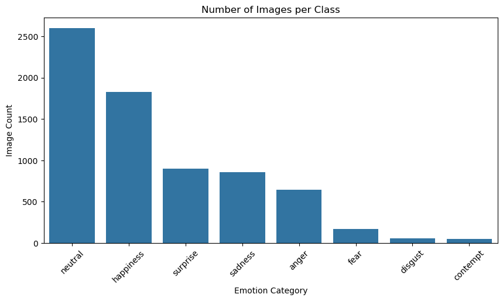

# Emotion Recognition using Deep Learning
## 📖 Introduction
Recognizing emotions through facial expressions is a fundamental task in computer vision, widely used in applications like human-computer interaction, mental health analysis, and AI-driven customer insights. 
📊 Dataset: [🔗 View the Dataset on Kaggle](https://www.kaggle.com/datasets/subhaditya/fer2013plus/data) 
FER2013+ is an updated version of the FER2013 dataset. The previous version contained many mislabeled images, making it difficult to achieve good results. This improved dataset provides more accurate labels, allowing for better model performance. 

Here's the difference between FER2013 and FER2013+ according to Microsoft Github:
 

The dataset contains 28,386 images for training and 7,099 images for testing. There are 8 classes in total which Anger, Contempt, Disgust, Fear, Happiness, Neutral, Sadness, Surprise. All images are 48x48 pixels.

## 🧠 Results with MiniVGG

As we can see, the results are decent for 81.4% accuracy on test data.

## ❌ Problems
🟥 There are classes that are hard for the model to recognize. Such as Disgust, Contempt, and Fear. I have already tried to replicate the expressions from the training and testing data, but it is still hard for the model to recognize them. This is caused by the uneven class distribution.

As you can see, the quantities of the Disgust, Contempt, and Fear classes are much lower than those of other classes in the training data. Based on the Exploratory Data Analysis (EDA), Disgust has only 57 samples, Contempt has 51 samples, and Fear has 167 samples.
